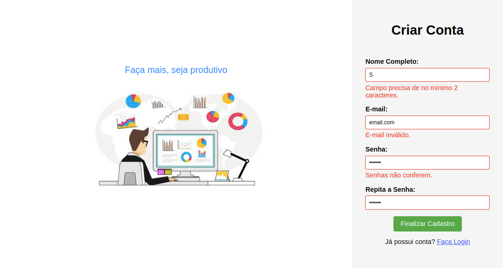

# Live do Professor Bonieky # 3 Projetos usando JavaScript, HTML e CSS

3 projetos feitos em Javascript durante a live do prof. Bonieky da B7Web Cursos.

## Urna Eletrônica

Um simulador da urna eletrônica brasileira. O script recebe um arquivo JSON contendo as etapas da eleição, bem como os candidatos disponíveis para o pleito.

### [http://saulomlcosta.epizy.com/educ1/urna-eletronica/index.html](http://saulomlcosta.epizy.com/educ1/urna-eletronica/index.html)

## SlideShow

Um slider de fotos com botões para avançar, voltar e pausar a apresentação.

### [http://saulomlcosta.epizy.com/educ1/slideshow/index.html](http://saulomlcosta.epizy.com/educ1/slideshow/index.html)

## Validação de Formulário

Um formulário que, ao ser enviado, é validado pelo próprio navegador. São mostradas mensagens de erro para o usuário.

### [http://saulomlcosta.epizy.com/educ1/formulario/index.html](http://saulomlcosta.epizy.com/educ1/formulario/index.html)

